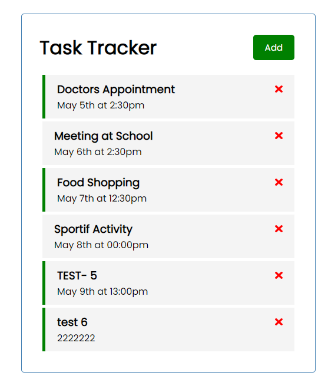
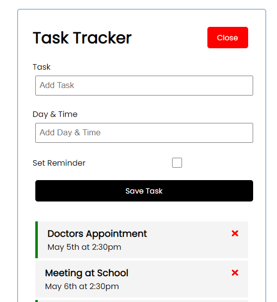

Angular Crash Course

Traversy Media

youtube 

https://www.youtube.com/watch?v=3dHNOWTI7H8

https://github.com/bradtraversy/angular-crash-2021

# Angular Crash Course 2021 (Task Tracker App)

This is the project from the YouTube crash course. It includes the Angular ui as well as JSON-server for our mock backend
 

# Usage

# Install dependencies

npm install

#  json server install
npm install -g json-server

json-server --watch db.json

if (Error: ENOSPC: System limit for number of file watchers reached angular )
    (solution : sudo sysctl -w fs.inotify.max_user_watches=524288)

# Run Angular server (http://localhost:4200)
ng serve

# Run the JSON server (http://localhost:5000)

npm run server

# To build for production

ng build